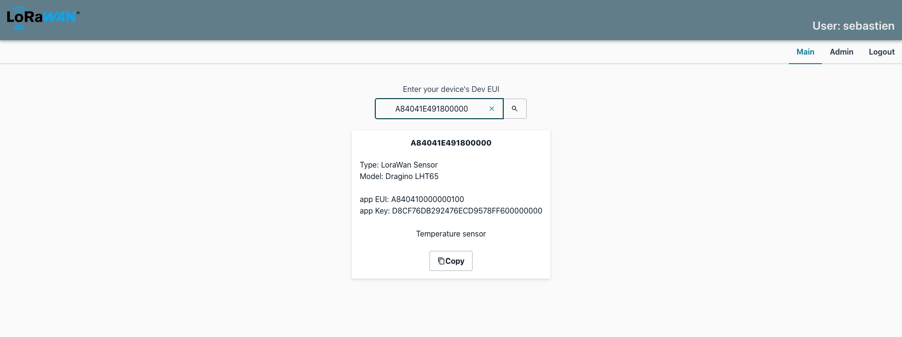
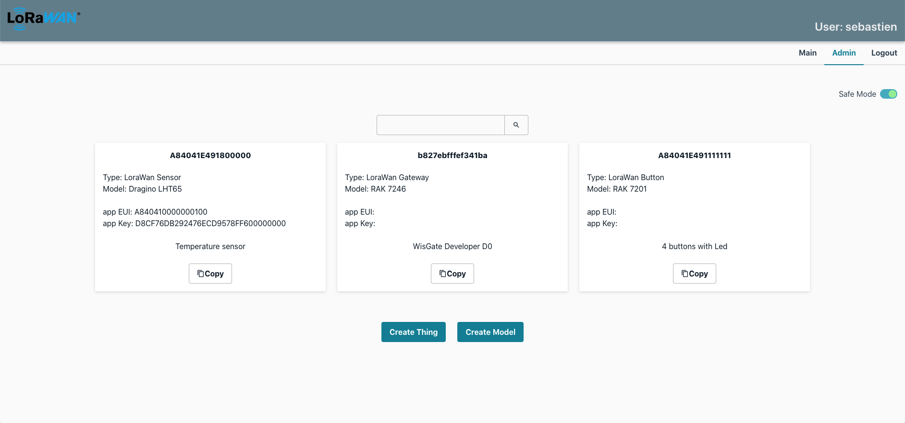
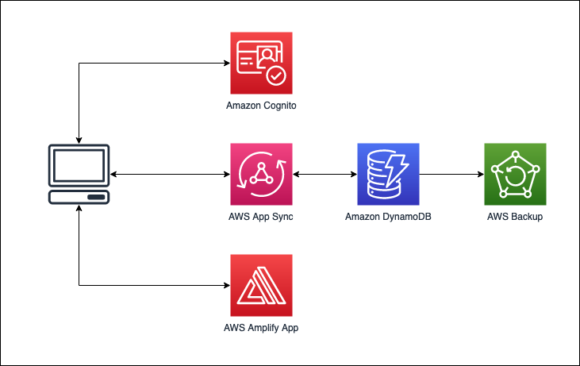

# IoT Things Library

This project is a serverless application to store and share informations about your LoraWan devices.

The principle of the application is simple: a user can get informations about an object only if he can provide its *Dev EUI*. As a consequence, the main page of the project is a simple search field where the user can enter a valid *Dev EUI*

If a user has admin rights, he can create, list, update and delete objects.

This application can be used to share devices informations only with people using the said devices.

## Solution Architecture

## Application Deployment

### pre requisite
To deploy this project, you need an AWS account. You also need the AWS cli and CDK cli installed and configured on your development environment.

### deployment
- Clone the GitHub project in your own GitHub account
- Clone the project on your local machine
- In GitHub, generate an OAuth token and store it in your AWS account secrets manager under the my-github-token key
- in the iot-things-library-infra folder, run "make all"

This will deploy 2 cloud formations stack using AWS CDK:
- One stack creates the AWS amplify app and connect it to the GitHub repository
- One stack creates a backup plan in AWS Backup.

Once the two stacks are deployed, the AWS Amplify pipeline will be automatically triggered to build the application backend and frontend.

You can then access the application using the Amplify application URL.

**Important**: You need to create a first user in Amazon Cognito and to add it to the admin group.

This project was bootstrapped with [Create React App](https://github.com/facebook/create-react-app).

